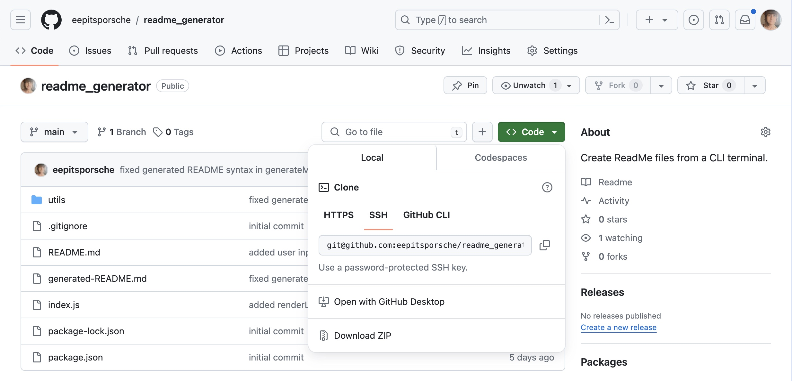
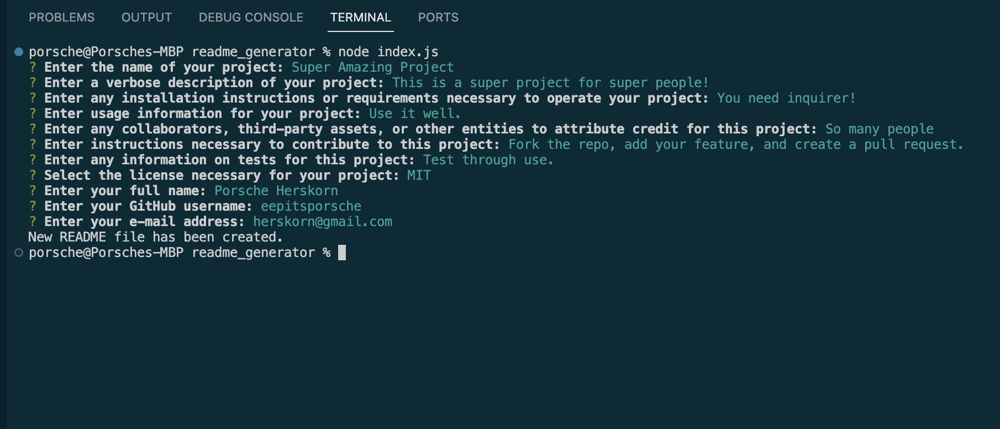
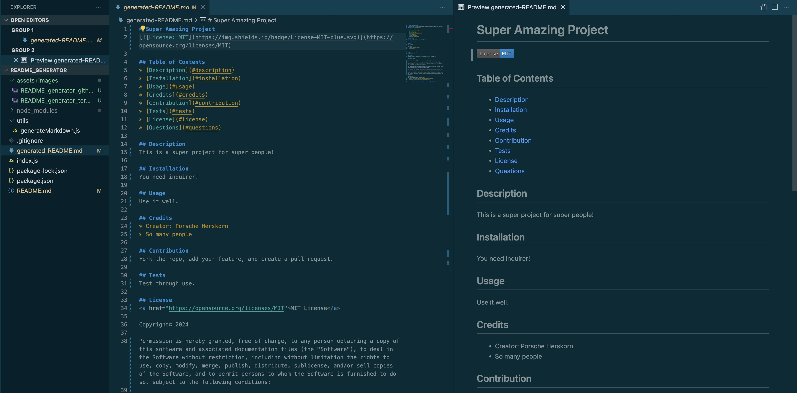

# README Generator

## Table of Contents

* [Description](#description)
* [Installation](#installation)
* [Usage](#usage)
* [Credits](#credits)
* [Technologies Used](#technologies-used)
* [License](#license)

## Description
The README Generator provides users with an easy-to-use program to create a professional README for their project. User input taken from a series of prompts is applied to the program to produce a README file with dynamic markdown syntax.

Future development for this app could include the feature of omitting a section when no entry has been made by the user.

## Installation
[Inquirer v8.2.4](https://www.npmjs.com/package/inquirer/v/8.2.4) must be installed to operate this app.

## Usage
[Clone the repository](https://github.com/eepitsporsche/readme_generator) to your machine and open the application in VS Code.

To initiate the README Generator, enter the <code>node index.js</code> command into the index.js terminal.

After answering the prompts, a README file entitled "generated-README.md" with the user's reponses will be created.

[Click here](https://drive.google.com/file/d/1m8n0c18xIPF1WtMD-vqTPWTqhQoyKBnl/view?usp=share_link) to view the video walk-through.

## Credits
* [Egghead.io](https://egghead.io/lessons/javascript-how-to-write-a-javascript-library-adding-badges-to-your-readme) for information on including license badges in a README.md
* [SitePoint](https://www.sitepoint.com/understanding-module-exports-exports-node-js/) for information on the module.export method
* [DopeDev YouTube Channel](https://www.youtube.com/watch?v=9YivEQFpmHQ) for walk-through tutorial
* UCB Bootcamp provided file structure and function framework for this project.

## Technologies Used
* VS Code
* JavaScript
* Node.js
* Inquirer

## License
N/A

### 
[Back to Top](#readme-generator)
